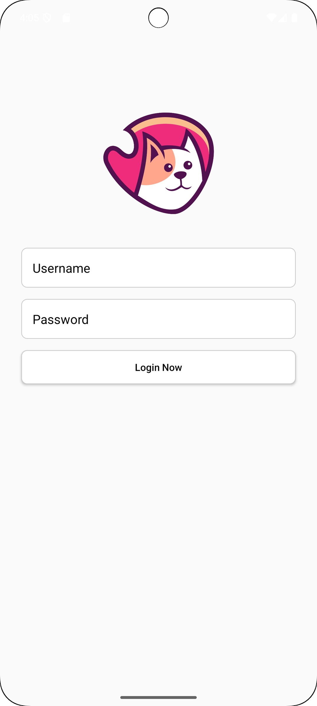
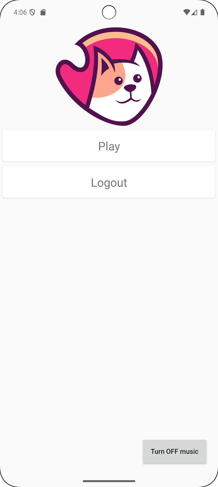
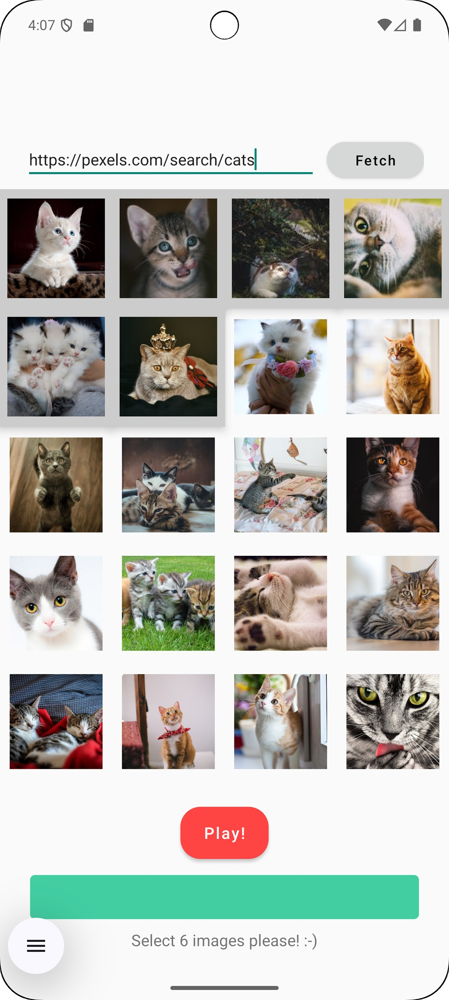
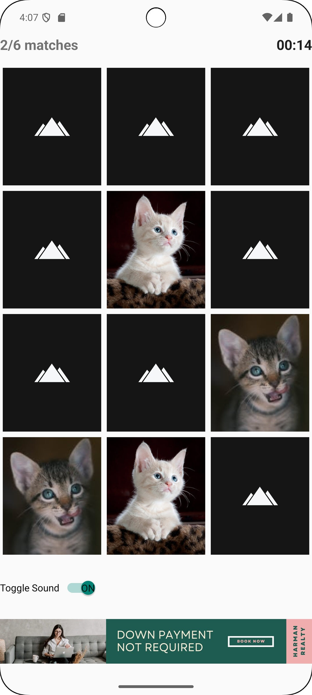
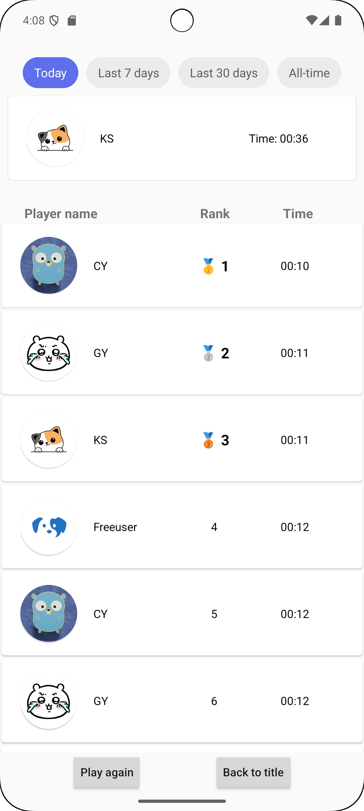

<p align="center">
  
</p>

# Memory Game Team 2 SA4108 🎴 


A card matching game built in Kotlin (Android Studio) and .NET (Backend). This repository is the Android Studio frontend. Backend can be accessed [here](https://github.com/Team-2-SA60/MemoryGameBackEnd.git).

Users log in, fetch 20 images from a webpage, and select 6 to play a classic memory match game.  Free-to-play users see rotating ads every 30 seconds. Completion times are uploaded to the server to populate a leaderboard.

## Features

- **Login**: Username/password authentication against a .NET backend.  
- **Image Fetching**: Scrape the first 20 images from any URL with a progress bar.  
- **Custom Selection**: Allow users to pick 6 images to generate the game deck.  
- **Gameplay**: 12 shuffled cards in a grid.  
- **Ads**: Free users see rotating ad images every 30 seconds; paid users play ad-free.  
- **Leaderboard**: On completion, send time to backend and show top records.

## Preview

| Login                      | Menu                      | Fetch                      | Play                      | Leaderboard                      |
|----------------------------|---------------------------|----------------------------|---------------------------|----------------------------------|
|  |  |  |  |  |

## Setup & Run

1. Clone the repository
   ```bash
   git clone git@github.com:Team-2-SA60/MemoryGameAndroid.git

2. Open in Android Studio
3. Sync Gradle & Configure SDK (minSdk = 27; targetSdk = 35)
4. Start an Android emulator
5. Click Run ▶️ in Android Studio’s toolbar
6. Login and test using demo accounts
   - Free User (With advertisements)
   ```
   Username: freeuser
   Password: free
   ```
   - Paid User (No advertisements)
   ```
   Username: paiduser
   Password: paid
   ```
## Team 2️⃣

- [@Adrian](https://github.com/adriantlh)
- [@Bo Fei](https://github.com/Bofei2058)
- [@Cai Yun](https://github.com/vegecloud)
- [@Kin Seng](https://github.com/im-ksc)
- [@Gong Yuan](https://github.com/gongyuannn)
- [@Run Xin](https://github.com/ZRX471)
